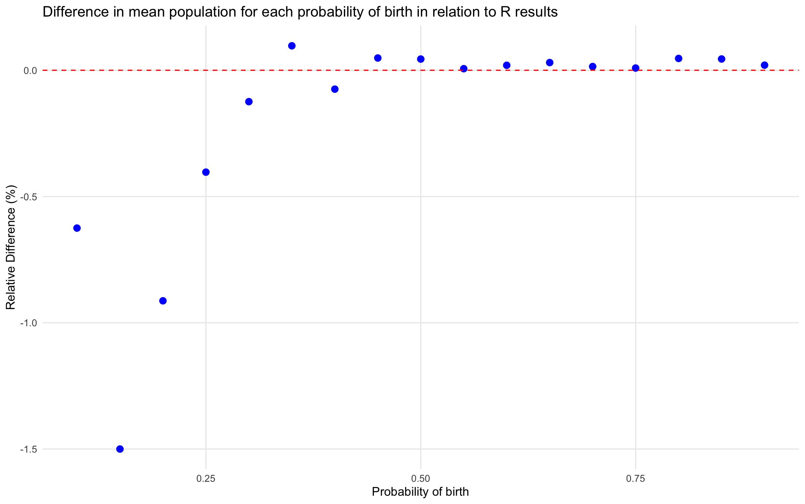
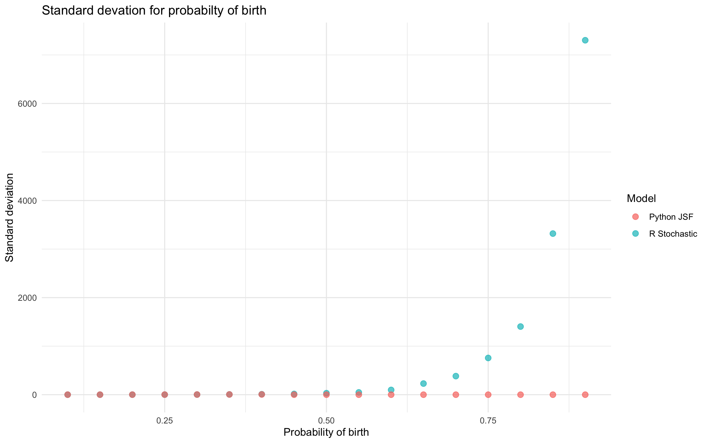

Hard taks:
#### **1. Methodology**

To compare the **R Stochastic** and **Python JSF** models, I conducted **50 independent trials** for 17 birth rate increments from 0.1 to 0.9.

- **Parameters:** Initial Population $P_0​ = 100$ Max Time $T = 8$.
    
- **Process:** The death rate $d$ was set as $d=1−b$.
    
- **Metrics:** I recorded the final population at $T=8$ to calculate the **mean** and **standard deviation** for each model.

#### **2. Mean Population Analysis: Convergence at Scale**

- **Observation:** As the birth rate increases (leading to larger final populations), the difference between the two models' averages disappears.
    
- **Conclusion:** The Python JSF approximation is accurate for predicting the **expected value** of a growing population.

#### **3. Standard Deviation Analysis: The Chaos Gap**

- **Observation:** In the R model, the Standard Deviation (SD) grows exponentially with the birth probability In the Python model, the SD stays low no matter the birth rate.
    
- **Conclusion:** The R model shows more 'noise' as the population grows. The Python model loses all its noise and becomes a flat line once the birth rate is high. This shows that while R is  simulating individual random events Python is using a simplified formula.